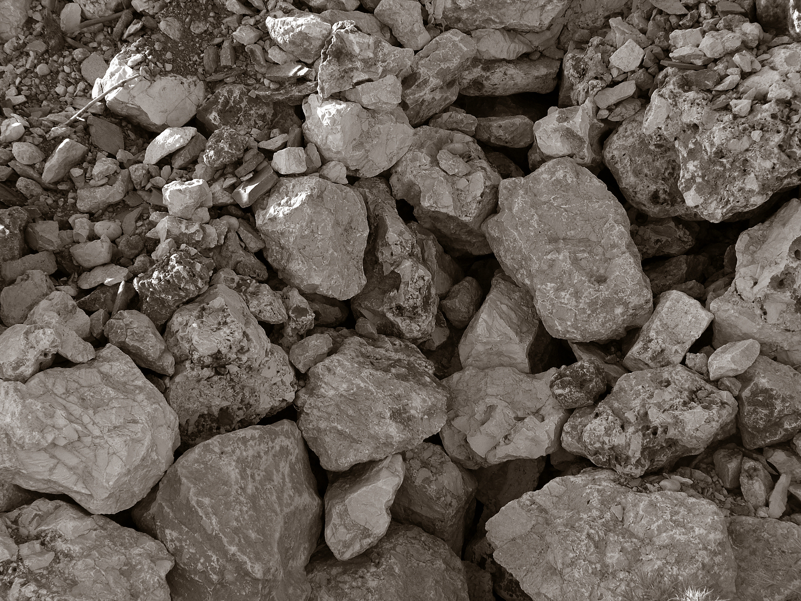

# Barrier

## God desired companionship

## He created Adam/Eve in His image.
#### *Gen 1: 27*
> So God created mankind in his own image, in the image of God he created them; male and female he created them.

## He breathed eternity in them.
#### *Gen 2: 7* 
> Then the Lord God formed a man from the dust of the ground and breathed into his nostrils the breath of life, and the man became a living being.

#### *Eccl 3: 11*
> He has made everything beautiful in its time. He has also set eternity in the human heart; yet[a] no one can fathom what God has done from beginning to end.

Daily God talked with them in their garden paradise.
After they ate the forbidden, they hid from Him.

## Adam passed sin to the human race
Human beings are born in sin.
#### *Psalms 51: 5*
> Surely I was sinful at birth, sinful from the time my mother conceived me.
Our self-willed nature tends to disobey.
Sin still separates us from God.
#### Romans 3: 23
> All have sinned and fallen short of the glory of God.

## Our God's love executed a rescue plan to save us.
God came to earth as a baby, Jesus Christ.
His death paid to remove sin's barrier. 
#### Romans 5: 8
> But God demonstrates his own love for us in this: While we were still sinners, Christ died for us.

## Our Responsibility: Repentance
Jesus seeks the one who is lost.
His angels jump for joy with Him when one person apologizes for sin and desires change.
#### Luke 15: 2-7
> Heaven rejoices when one sinner repents.

## LifeSource
Repentance prepares your heart for God's refreshing water.
#### Acts 3: 19
> Repent, then, and turn to God, so that your sins may be wiped out, that times of refreshing may come from the Lord,

#### Acts 2: 38
> Peter replied, “Repent and be baptized, every one of you, in the name of Jesus Christ for the forgiveness of your sins. And you will receive the gift of the Holy Spirit.
