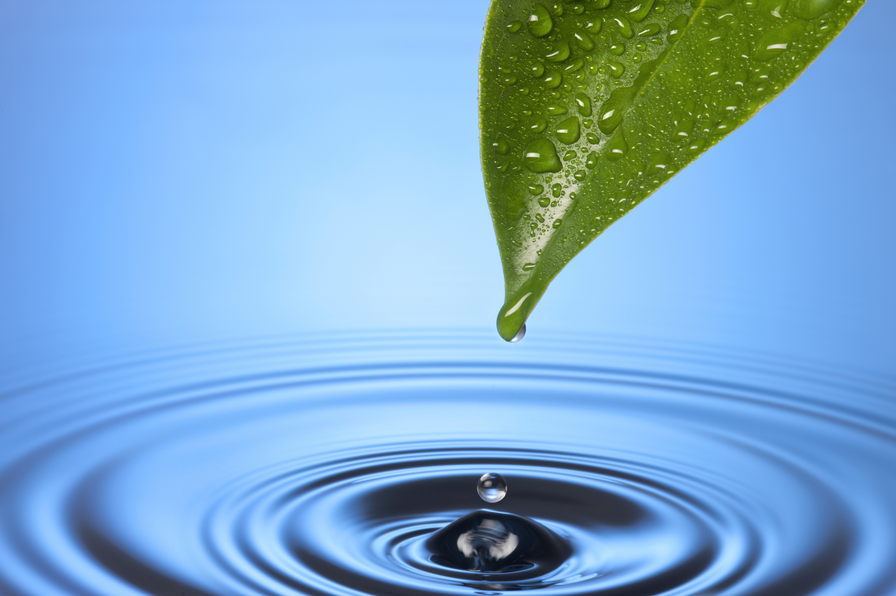

# Thirst

#### *Revalations 22:17*
>The Spirit says come. Take the water freely.

## Are you 'thirsty?'
Success and pleasure don't quite satisfy?

Underlying sense:
* There's something bigger out there.
* Surely there's more to life than this.
* Life isn't over when we die.

## Every person is created with a soul
An empty, untapped fountain designed for God's Holy Spirit.

#### *Gen 2:7*
> Then the Lord God formed a man from the dust of the ground and breathed into his nostrils the breath of life, and the man became a living being.

## Jesus said, "I am the eternal LifeSource."
#### *John 14: 6*
> I am the way, the truth, and the life. 

#### *John 7:37-38*
>
If anyone thirsts, let him come to Me and drink. Whoever believes in me, as Scripture has said, rivers of living water will flow from within them.
