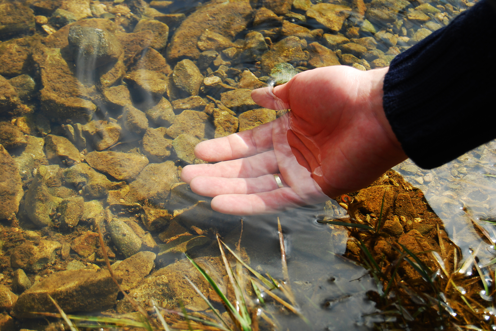

# Wash

## Forgiven sins must be washed away.
#### *Acts 22: 16*
> And now what are you waiting for? Get up, be baptized and wash your sins away, calling on his name.’
Repentance is the apology for an offence.
Water baptism cleans the mess it's made.

## Jesus' blood cleanes ALL sin.
#### *1st John 1:7*
>But if we walk in the light, as he is in the light, we have fellowship with one another, and the blood of Jesus, his Son, purifies us from all sin.

Crucifixion proved His love.
#### *Romans 5: 8*
>But God demonstrates his own love for us in this: While we were still sinners, Christ died for us.
#### *John 3: 16*
>For God so loved the world that he gave his one and only Son, that whoever believes in him shall not perish but have eternal life.

Sin past, present, future -- PAID
#### *Hebrews 7: 27*
>Unlike the other high priests, he does not need to offer sacrifices day after day, first for his own sins, and then for the sins of the people. He sacrificed for their sins once for all when he offered himself.

## How Bible believers were baptized
All believers called the name of the Lord Jesus Christ at water baptism.
#### *Acts 2: 38-41*
>38 Peter replied, “Repent and be baptized, every one of you, in the name of Jesus Christ for the forgiveness of your sins. And you will receive the gift of the Holy Spirit. 39 The promise is for you and your children and for all who are far off—for all whom the Lord our God will call.”
>
>40 With many other words he warned them; and he pleaded with them, “Save yourselves from this corrupt generation.” 41 Those who accepted his message were baptized, and about three thousand were added to their number that day

#### *Acts 8: 16*
>because the Holy Spirit had not yet come on any of them; they had simply been baptized in the name of the Lord Jesus.

#### *Acts 10: 48*
>And he commanded them to be baptized in the name of the Lord. Then prayed they him to tarry certain days.

#### *Acts 19: 5*
>On hearing this, they were baptized in the name of the Lord Jesus.

Jesus and His followers went under the water.
#### *Matthew 3: 16*
>As soon as Jesus was baptized, he went up out of the water. At that moment heaven was opened, and he saw the Spirit of God descending like a dove and alighting on him.

#### *Acts 8: 38*
>And he commanded the chariot to stand still: and they went down both into the water, both Philip and the eunuch; and he baptized him.

## Invoke Jesus' blood: Speak His name
#### *Acts 4: 12*
> There is no other name under heaven by which we must be saved.

## Ready for the LifeSource
Water baptism cleans our internal fountain for Holy Spirit water.
#### *Acts 2: 38*
> Repent and be baptized in the name of Jesus Christ for the remission of sins; and you shall recieve the gift of the Holy Spirit.

## Why wait?
Bible believers were baptized immediately upon conversion.
#### *Acts 22: 16*
>And now what are you waiting for? Get up, be baptized and wash your sins away, calling on his name.’

#### *Acts 2: 41*
>Those who accepted his message were baptized, and about three thousand were added to their number that day.

#### *Acts 8: 35-39*
> 35 Then Philip began with that very passage of Scripture and told him the good news about Jesus.
>
>36 As they traveled along the road, they came to some water and the eunuch said, “Look, here is water. What can stand in the way of my being baptized?” [37] [a] 38 And he gave orders to stop the chariot. Then both Philip and the eunuch went down into the water and Philip baptized him. 39 When they came up out of the water, the Spirit of the Lord suddenly took Philip away, and the eunuch did not see him again, but went on his way rejoicing. 

#### *Acts 16: 33*
>At that hour of the night the jailer took them and washed their wounds; then immediately he and all his household were baptized.