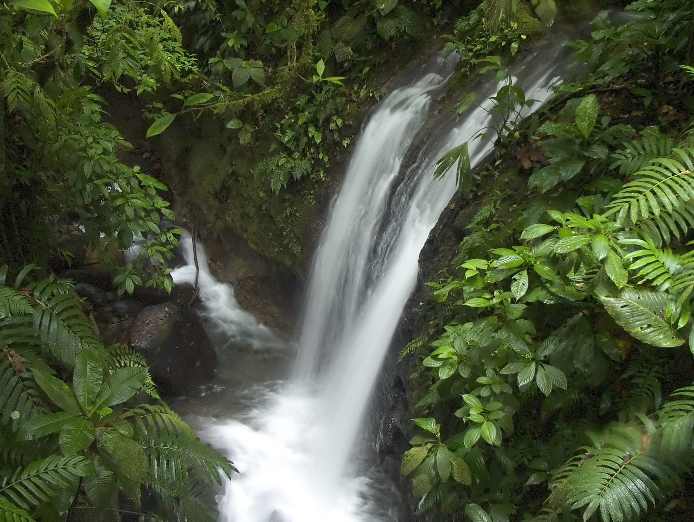

# Well Spring

## Holy Spirit promise
Jesus told believers before He ascended to Heaven

## They prayed UNTIL His Spirit came
Bystanders heard believers speaking languages they hadn't learned, empowered by the Spirit.
#### *Acts 2: 1-4*
>When the day of Pentecost came, they were all together in one place. 2 Suddenly a sound like the blowing of a violent wind came from heaven and filled the whole house where they were sitting. 3 They saw what seemed to be tongues of fire that separated and came to rest on each of them. 4 All of them were filled with the Holy Spirit and began to speak in other tongues as the Spirit enabled them.

## They asked, "What does this mean?"
Peter said, "It's the Spirit promise!" *Acts 2: 5 - 17*
They asked, "What must WE do?" *Acts 2: 37*

#### Acts 2: 38
> Repent and be baptised in the name of Jesus Christ for the remission of sins and you shall recieve the gift of the Holy Spirit.

Supernatural speaking is the sign of the Holy Spirit
#### Acts 2: 4
> All of them were filled with the Holy Spirit and began to speak in other tongues as the Spirit enabled them.

#### Acts 10: 44 - 46
>44 While Peter was still speaking these words, the Holy Spirit came on all who heard the message. 45 The circumcised believers who had come with Peter were astonished that the gift of the Holy Spirit had been poured out even on Gentiles. 46 For they heard them speaking in tongues and praising God.

#### Acts 19: 6
> When Paul placed his hands on them, the Holy Spirit came on them, and they spoke in tongues and prophesied.

## New Life emerges where the river flows.
The Holy Spirit river reverses sin's curse.
Everything lives where the river goes. 
#### Ezekiel 47: 9
>  Swarms of living creatures will live wherever the river flows. There will be large numbers of fish, because this water flows there and makes the salt water fresh; so where the river flows everything will live.

The Holy Spirit river brings peace, power, deliverance, salvation, and healing.
#### Ezekiel 47: 1 - 12
>The man brought me back to the entrance to the temple, and I saw water coming out from under the threshold of the temple toward the east (for the temple faced east). The water was coming down from under the south side of the temple, south of the altar. 2 He then brought me out through the north gate and led me around the outside to the outer gate facing east, and the water was trickling from the south side.
>
>3 As the man went eastward with a measuring line in his hand, he measured off a thousand cubits[a] and then led me through water that was ankle-deep. 4 He measured off another thousand cubits and led me through water that was knee-deep. He measured off another thousand and led me through water that was up to the waist. 5 He measured off another thousand, but now it was a river that I could not cross, because the water had risen and was deep enough to swim in—a river that no one could cross. 6 He asked me, “Son of man, do you see this?”
>
>Then he led me back to the bank of the river. 7 When I arrived there, I saw a great number of trees on each side of the river. 8 He said to me, “This water flows toward the eastern region and goes down into the Arabah,[b] where it enters the Dead Sea. When it empties into the sea, the salty water there becomes fresh. 9 Swarms of living creatures will live wherever the river flows. There will be large numbers of fish, because this water flows there and makes the salt water fresh; so where the river flows everything will live. 10 Fishermen will stand along the shore; from En Gedi to En Eglaim there will be places for spreading nets. The fish will be of many kinds—like the fish of the Mediterranean Sea. 11 But the swamps and marshes will not become fresh; they will be left for salt. 12 Fruit trees of all kinds will grow on both banks of the river. Their leaves will not wither, nor will their fruit fail. Every month they will bear fruit, because the water from the sanctuary flows to them. Their fruit will serve for food and their leaves for healing.”

#### Romans 14: 17
> For the kingdom of God is not a matter of eating and drinking, but of righteousness, peace and joy in the Holy Spirit,

#### Luke 4: 18 - 21
> 18 Then they called them in again and commanded them not to speak or teach at all in the name of Jesus. 19 But Peter and John replied, “Which is right in God’s eyes: to listen to you, or to him? You be the judges! 20 As for us, we cannot help speaking about what we have seen and heard.”
>
> 21 After further threats they let them go. They could not decide how to punish them, because all the people were praising God for what had happened. 

## LifeSource: Eternal Waters of the Holy Spirit
#### John 4: 14
>It will become in him a fountain of water springing up into everlasting life.

#### Romans 8: 11
> If the Spirit of Him who raised Jesus from the dead dwells in you, He will also give life to your mortal bodies

## Thirsty?
#### Revalations 22: 17
> The Spirit says come. Take the water freely.